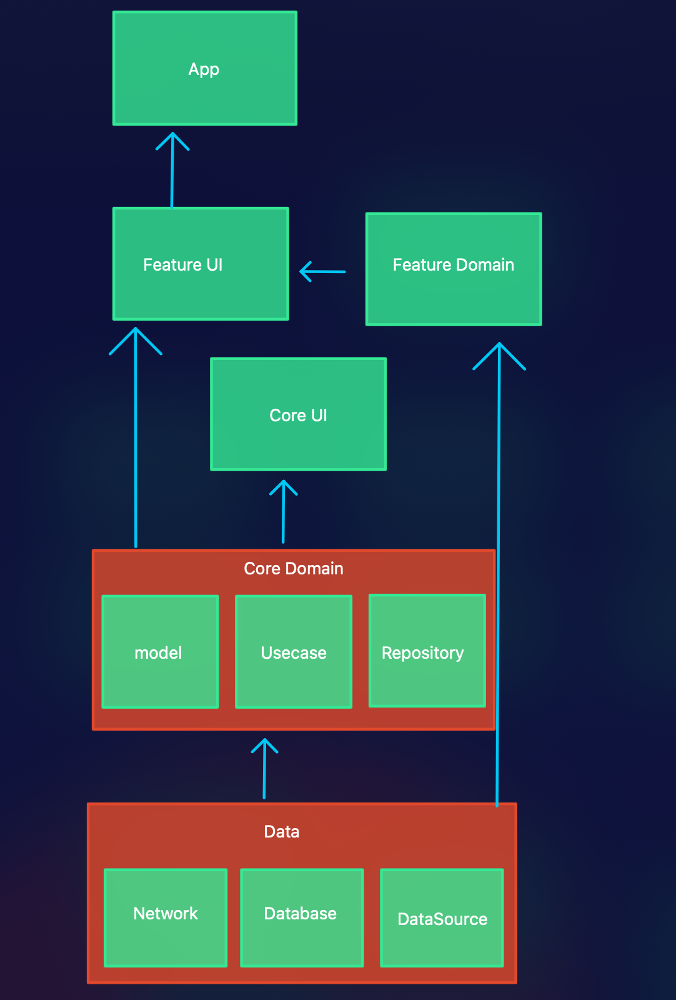

## Code structure

## Architecture Components

## Modularisation Approach

The application is modularised by feature. Each feature of the app may have some or all of
the layers above implemented (e.g. `:feature:movies:presentation`, `:feature:movies:domain`).

There is a core module for each layer that defines general use functions.

### App module

The module responsible for navigating to the different screens, for connecting things. 

### Presentation Layer

The presentation layer contains all the logic for showing a user a screen. The presentation layer
depends on the domain layer.

Each presentation layer should define a navigation interface detailing where this layer may navigate
to (external to this module), that the app module will implement. This is done so that this module
has no dependencies on other presentation modules.

Externally visible classes are the Controllers that act as entry points to this module, and any
contracts that wrap those controllers. All the views and view models should be marked internal.

### Domain Layer

The domain module contains related UseCase components. It should only depend on domain modules.
This module should be pure kotlin (no Android).

### Data Layer

The data layer contains the repository implementations and DAOs and Services for a specific feature.
This layer only depends on the domain layer for the same feature.

The repository implementation should be the only publicly visible class (just for DI stuff). The
services and DAOs should be part of the network and database modules.

## Architecture

### Contract

The contract for a screen defines all the interfaces used by the various components within a screen.
This includes:

- State - The base data class that defines how to render the screen. This is passed to the view.
- Events - Sealed class of one time events passed in a stream from ViewModel to Controller (e.g.
  navigate to another place, ask for a permission - clicks etc)

The contract is intended to provide a single place that developers can go to and look at to
understand a specific screen better.

### View

The class which renders the screen.

### ViewModel

The view model contains all the logic about a single screen, and generates UiModels and events that
the controller observes.

View models should be thoroughly tested to ensure correct behaviour of a screen.

### Domain Model

The domain model is a data class for a specific feature concept. The
domain model is the model that is used to communicate between all the other layers in the app.

The domain model will usually match an API model fairly consistently, though some places may have
different structures if the API structure does not make sense for the app.

Though domain models are usually plain data classes, they can contain functions for derived
properties, or extension functions on other types for logic related to the domain model.

### Repository

The repository interface lives in the data layer, and defines functions to get, save and modify
domain models. This is defined as an interface in order to satisfy the dependency inversion.

The repository is responsible for abstracting the source of data, and for caching data where
appropriate. This means that callers do not know whether the data is being served from a local
cache, shared preferences, from the server etc.

### RepositoryImpl

The repository implementation lives in the data layer. It implements the repository interface and
uses the services and DAOs to fetch, store and update the data as required.

### Service

The service is a retrofit interface that will implement the API calls. The repository is responsible
for handling the API responses and converting them (via a mapper if required) to domain models.
This conversion involves handling any specific error responses and converting them to domain models.

This usually involves the repository returning a sealed class that has all the specific success and
error states as an individual item.

### DAO

The DAO is a class that implements database operations for a specific feature.

In order to run the paparazzi screens `./gradlew recordPaparazziDebug`  
In order to run all the unit tests do
`./gradlew :feature:tvshow:presentation:testDebugUnitTest :feature:movies:presentation:testDebugUnitTest --tests='*.*Test*' --tests='!*.PaparazziScreenTest'`
